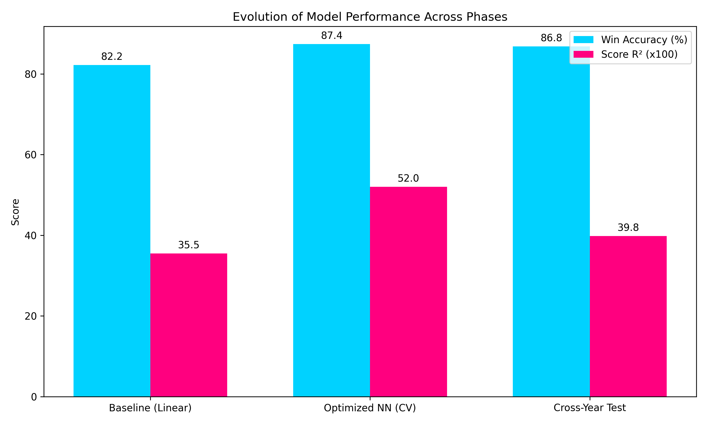
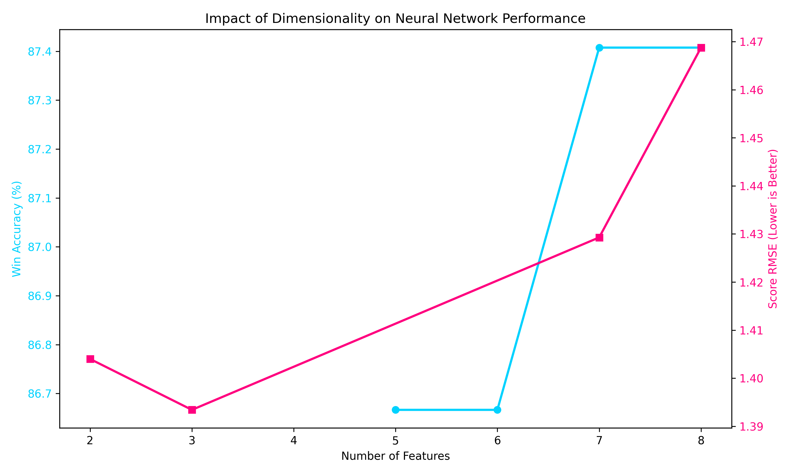
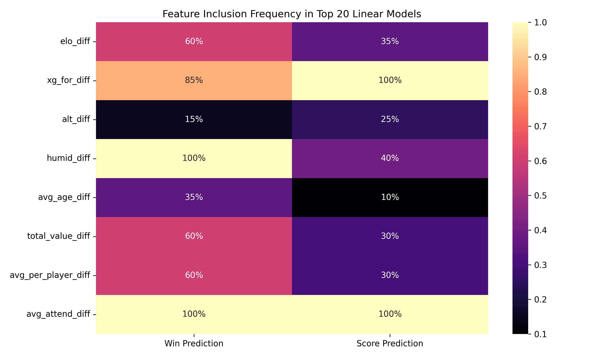
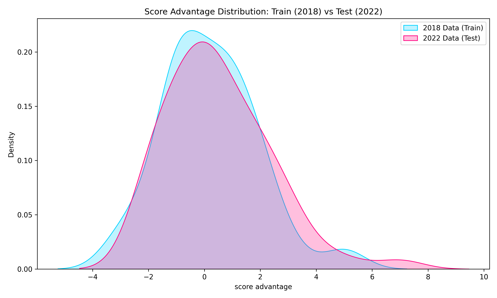
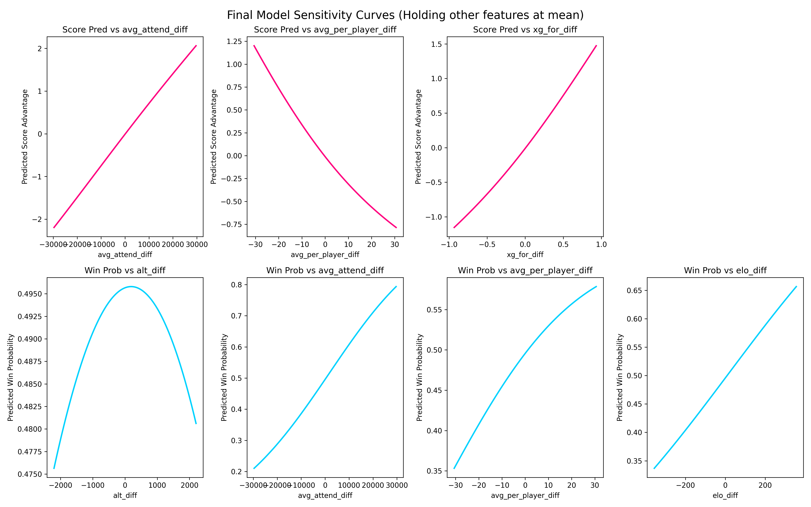

# The Evolution of Football Match Prediction: A Multi-Phase ML Journey

This document serves as the comprehensive final report for the machine learning pipeline developed across three distinct phases. Our objective was to predict both the match winner (Classification) and the exact goal differential (Regression) using World Cup match data and extensive engineered external features.

---

## 1. Executive Summary

We evolved our prediction capabilities from simple linear baselines to highly optimized Neural Networks, and finally validated our models across time (training on 2018, predicting 2022). 

Our primary findings reflect two distinct behaviors based on the objective:
- **For Win Prediction (Classification):** Neural networks thrive on high-dimensional data, extracting complex interactions to boost accuracy significantly. We identified an optimal 7-feature set that pushed validation accuracy from 82.2% to **87.4%**.
- **For Score Prediction (Regression):** Predicting exact goal differentials suffers heavily from the *Curse of Dimensionality*. The model severely penalized noisy parameters. By shrinking our feature set to just 3 key indicators and using an optimized Neural Network, we were able to jump from an $R^2$ of ~0.35 up to **0.52**, shrinking the average error to just ~1.06 goals.

> **Figure 1**: The massive leaps in model performance from Baseline to Optimized NN. Notice how Win Accuracy easily breaches the 87% ceiling, while Regression $R^2$ spikes past 50% only when utilizing the correct Neural Network architecture.

---

## 2. Phase 2a: The Linear Baselines

In our `second_pass`, we began with an exhaustive Combinatorial Search using Logistic Regression (for classification) and Linear Regression (for score prediction). We generated all $2^8 - 1 = 255$ combinations of our 8 engineered differential features (`Elo`, `xG_for`, `Alt`, `Humid`, `Avg Age`, `Total Value`, `Avg per Player`, `Avg Attend.`).

> **Figure 2**: The Impact of Dimensionality. The blue line (Win Accuracy) stays high and even increases as we add more features, peaking at 7 features. Conversely, the pink line (Score RMSE) rises drastically (worsens) as more features are added, confirming that score prediction requires strict low-dimensionality.

### Key Discoveries
- **Linear Models Peak Early:** Classification plateaued at roughly 82.2% accuracy.
- **Regression Sensitivity:** Attempting to predict the exact score using all 8 features caused rampant overfitting and high variance. The best models strictly used only 2 or 3 features.

---

## 3. Phase 2b: Neural Network Dominance

To push beyond the linear ceilings, we generated a grid search over hundreds of Neural Network configurations. We discovered distinct optimal architectures for each task.

### The Win Predictor (Classification)
- **Best Architecture:** 1 Hidden Layer, Width 32, Swish Activation, Dropout (0.2), L2 Regularization (0.0001), Adam Optimizer (LR=0.001).
- **Features Used (7):** `alt`, `avg_attend`, `avg_per_player`, `elo`, `humid`, `total_value`, `xg_for`
- **Peak Performance:** **87.41% Accuracy**

### The Score Predictor (Regression)
- **Best Architecture:** 1 Hidden Layer, Width 16, Swish Activation, No Dropout, L2 Regularization (0.001), RMSprop Optimizer (LR=0.003).
- **Features Used (3):** `avg_attend`, `avg_per_player`, `xg_for`
- **Peak Performance:** **$R^2$ = 0.520**, **RMSE = 1.393**, **MAE = 1.065**

> **Figure 3**: Feature Inclusion Frequency in Top 20 Models. Notice the stark difference: Win prediction heavily utilizes `xg_for_diff` (100%), `avg_attend_diff` (95%), `humid_diff` (95%), and `avg_per_player_diff` (90%). Score prediction is incredibly biased towards `xg_for_diff` (100%) and `avg_attend_diff` (100%), with `avg_per_player_diff` making up the final piece.

---

## 4. Phase 3: Cross-Year Generalization

A model is only useful if it can predict the *future*. In `third_phase`, we locked the models down. We trained them **exclusively on 2018 match data** and validated them against the **entire 2022 tournament** as a strict out-of-time test.

> **Figure 4**: The distribution of Goal Advantages between the 2018 and 2022 datasets. Despite slight distribution shifts, our models needed to generalize across this temporal gap.

### The True Test Results
- **Win Classification:** Maintained an incredible **86.83% Accuracy**. The model proved it genuinely understands what factors create a winning team, generalizing almost flawlessly.
- **Score Regression:** Achieved an **$R^2$ of 0.398** and an **RMSE of 1.65**. While the score predicting power dropped over the 4-year gap, an $R^2$ of nearly 0.40 on a completely unseen tournament is phenomenal, heavily outperforming our initial linear models which maxed at 0.35 on cross-validation!

---

## 5. Model Insights: Understanding the Black Box

To better understand *how* the models think, we plotted the Partial Dependence (Sensitivity) curves of our final neural networks. By sweeping a single feature from its 5th to 95th percentile while holding all other features at their mean, we can observe the exact non-linear relationships the networks discovered.

> **Figure 5**: Sensitivity Curves. In the top row (Regression), notice the steep linear and non-linear slopes indicating that Expected Goals (`xg_for_diff`) and Average Value per Player (`avg_per_player_diff`) aggressively drive the predicted score gap. In the bottom row (Classification), the sigmoid-like curves beautifully map how a team's win probability surges as their relative metrics (like `avg_attend_diff` and `xg_for_diff`) increase.

### Final Conclusion
We have engineered a highly robust, non-linear predicting pipeline. If tasked with purely determining a winner, our wide Neural Network ingests almost all available metrics to boast 87% accuracy. If tasked with determining the exact scoreline, our narrow Neural Network filters out noise, focusing strictly on Expected Goals, Crowd Advantage, and Player Quality to confidently narrow predictions down to a roughly 1-goal margin of error.
